# Drockley Backend Architecture Documentation

Reverse-engineered from the implemented codebase in `src/main/java/com/platform/drockley`, `src/main/resources`, `build.gradle`, and the current test suite.

## 1. Executive Summary

Drockley is an education consultation platform backend. The implemented system supports user registration/login, JWT authentication, expert profile onboarding, expert search, availability slot management, booking, payment record handling, reviews, and session metadata management.

The current implementation is a single Spring Boot modular monolith. It is not a distributed system in code today. There are no implemented queues, schedulers, event buses, Redis caches, Docker manifests, Kubernetes manifests, or external HTTP clients. Razorpay appears as a declared dependency and configuration target, but payment verification is implemented locally through HMAC signature calculation rather than through Razorpay SDK calls.

Main technologies:

- Java toolchain: Java 25 in `build.gradle`
- Framework: Spring Boot 4.0.6
- Web: Spring Web MVC starter
- Persistence: Spring Data JPA and Hibernate
- Database target: PostgreSQL
- Test database: H2 in the context test
- Security: Spring Security, BCrypt, stateless JWT
- JWT library: JJWT 0.11.5
- Validation: Jakarta Bean Validation
- API documentation dependency: Springdoc OpenAPI
- Boilerplate: Lombok
- Build: Gradle wrapper

High-level design philosophy:

- Thin REST controllers return a uniform `ApiResponse<T>`.
- Service classes own business rules and transaction boundaries.
- Repositories are Spring Data JPA interfaces with a few derived queries and JPQL queries.
- Entities are JPA persistence models and are not exposed directly through controllers.
- DTO mapping is manual inside service implementations.
- Security is filter-based JWT authentication plus URL authorization rules.

## 2. Complete Project Structure Analysis

### Implemented Source Tree

```text
src/main/java/com/platform/drockley
|-- DrockleyApplication.java
|-- auth
|   |-- controller/AuthController.java
|   |-- dto/AuthResponse.java
|   |-- dto/LoginRequest.java
|   |-- dto/RegisterRequest.java
|   |-- service/AuthService.java
|   `-- service/impl/AuthServiceImpl.java
|-- common
|   |-- dto/*
|   `-- exception/*
|-- config
|   |-- ApplicationProperties.java
|   `-- SecurityConfig.java
|-- controller
|   |-- AvailabilityController.java
|   |-- BookingController.java
|   |-- ExpertController.java
|   |-- PaymentController.java
|   |-- ReviewController.java
|   |-- SessionController.java
|   `-- UserController.java
|-- entity
|   |-- AvailabilitySlot.java
|   |-- Booking.java
|   |-- Expertise.java
|   |-- ExpertProfile.java
|   |-- Payment.java
|   |-- Review.java
|   |-- Session.java
|   `-- User.java
|-- enums
|   |-- BookingStatus.java
|   |-- PaymentStatus.java
|   |-- Role.java
|   |-- SessionStatus.java
|   |-- UserStatus.java
|   `-- VerificationStatus.java
|-- repository
|   |-- AvailabilityRepository.java
|   |-- BookingRepository.java
|   |-- ExpertiseRepository.java
|   |-- ExpertRepository.java
|   |-- PaymentRepository.java
|   |-- ReviewRepository.java
|   |-- SessionRepository.java
|   `-- UserRepository.java
|-- security
|   |-- JwtAuthenticationFilter.java
|   `-- JwtTokenProvider.java
|-- service
|   |-- AvailabilityService.java
|   |-- AvailabilityServiceImpl.java
|   |-- BookingService.java
|   |-- BookingServiceImpl.java
|   |-- CustomUserDetailsService.java
|   |-- ExpertService.java
|   |-- ExpertServiceImpl.java
|   |-- PaymentService.java
|   |-- PaymentServiceImpl.java
|   |-- ReviewService.java
|   |-- ReviewServiceImpl.java
|   |-- SessionService.java
|   |-- SessionServiceImpl.java
|   |-- UserService.java
|   `-- UserServiceImpl.java
`-- utils
    |-- DateTimeUtil.java
    |-- PaginationUtil.java
    `-- SecurityUtil.java
```

Important structural observation: several implementation files physically live under `src/main/java/com/platform/drockley/service`, but declare package `com.platform.drockley.service.impl`. Java allows this during compilation, but it is confusing for navigation and should be corrected.

### Package Responsibilities

| Package | Actual responsibility |
|---|---|
| `auth` | Registration, login, token refresh endpoint and service. |
| `common.dto` | Shared request/response DTOs and common API wrapper. |
| `common.exception` | Runtime exception types and global exception-to-response mapping. |
| `config` | Spring Security filter chain and JWT property holder. |
| `controller` | REST API endpoints for domain workflows outside auth. |
| `entity` | JPA entities and relationships. |
| `enums` | State and role enumerations. |
| `repository` | Spring Data persistence access. |
| `security` | JWT token creation/parsing and request authentication filter. |
| `service` | Service interfaces, implementations, user-details integration. |
| `utils` | Date/time, pagination, and Spring SecurityContext helpers. |

### Dependency Direction

The implemented direction is mostly conventional:

```text
Controllers -> Services -> Repositories -> Entities -> Database
SecurityConfig -> JwtAuthenticationFilter -> JwtTokenProvider/UserRepository
GlobalExceptionHandler -> ApiResponse
Services -> DTOs, Entities, Repositories, Exceptions
```

There is no separate domain layer independent of JPA. Business logic operates directly on JPA entities.

### Dependency Graph

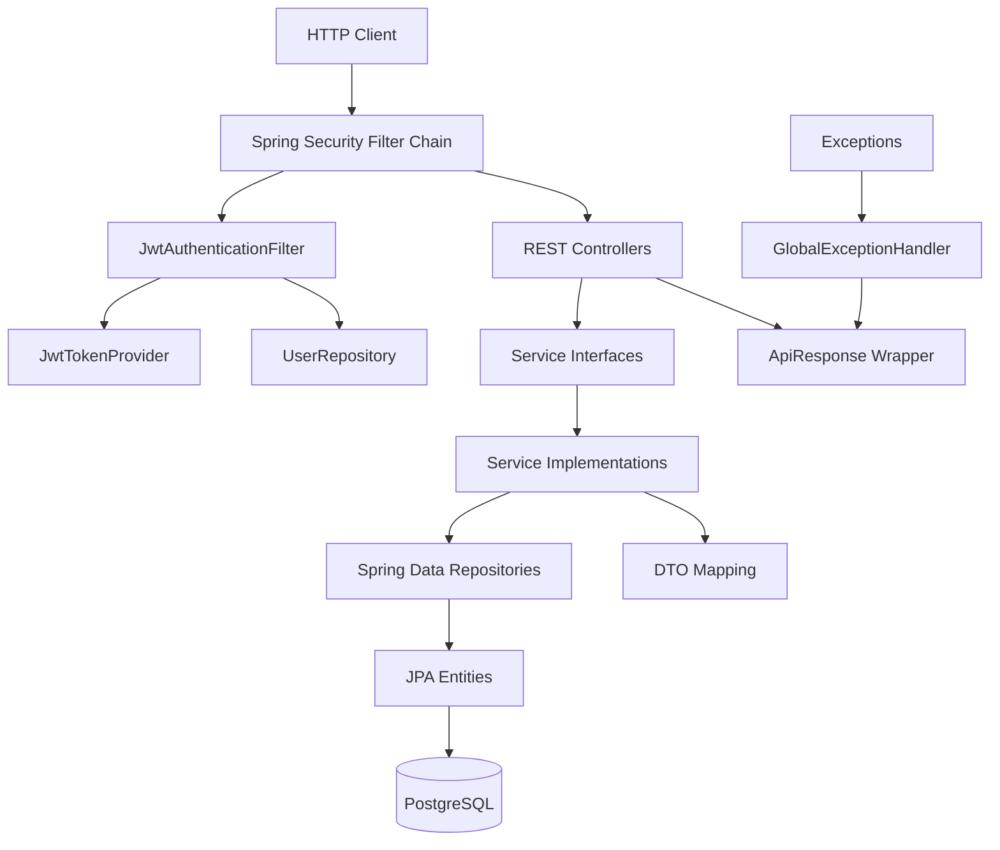

## 3. High Level Architecture Diagram

### Runtime Architecture

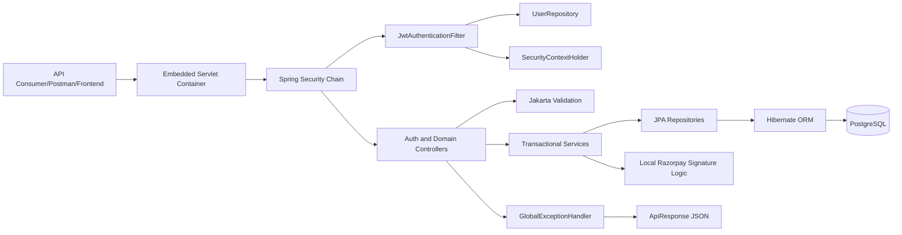

### External Systems and Runtime Dependencies

| Dependency | Implemented usage |
|---|---|
| PostgreSQL | Primary configured runtime database. |
| H2 | Test-only in `DrockleyApplicationTests`. |
| Razorpay | Dependency and configuration exist; no SDK call currently used. HMAC signature verification is local. |
| Springdoc OpenAPI | Dependency and YAML settings exist; no custom OpenAPI configuration class. |
| Flyway | Dependency and YAML enabled, but no `src/main/resources/db/migration` files exist. |
| Redis/cache | Not implemented. |
| Messaging | Not implemented. |
| Email/video integrations | Not implemented. |

## 4. End-to-End Request Flow

All protected API calls follow this general lifecycle:

1. Request enters embedded servlet runtime.
2. `SecurityFilterChain` applies stateless security and disables CSRF.
3. `JwtAuthenticationFilter` checks `Authorization: Bearer <token>`.
4. If valid, JWT subject is interpreted as user UUID and `role` claim as authority.
5. The filter reloads the user from `UserRepository`.
6. A `UsernamePasswordAuthenticationToken` with principal set to user email is placed into `SecurityContextHolder`.
7. URL authorization rules run.
8. Controller method is invoked.
9. `@Valid` validates request body DTOs where present.
10. Controller calls a service.
11. Service transaction starts where `@Transactional` applies.
12. Service calls repositories, mutates entities, maps response DTOs.
13. Controller wraps result in `ApiResponse<T>`.
14. Exceptions are handled by `GlobalExceptionHandler`.

### Authentication APIs

#### Register

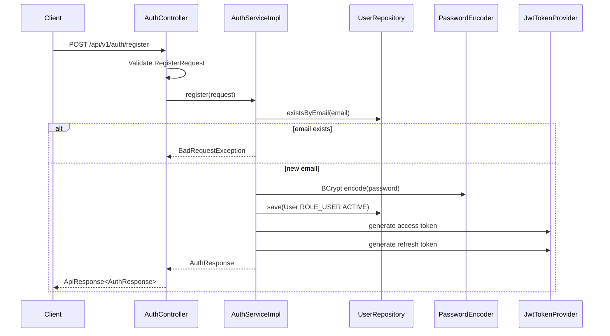

Notes:

- Registration is transactional.
- All new users are created with `ROLE_USER`, `ACTIVE`, `emailVerified=false`.
- There is no email verification flow in code.
- Refresh tokens are JWTs only; they are not persisted or rotated server-side.

#### Login

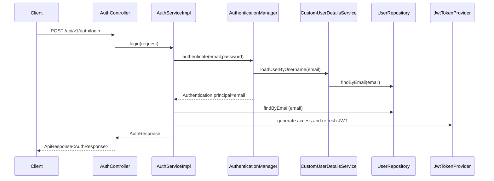

### User APIs

`GET /api/v1/users/me` gets current email from `SecurityUtil`, loads user by email, maps to `UserResponse`.

`PUT /api/v1/users/me` loads user by email to derive UUID, then `UserServiceImpl.updateUserProfile` selectively updates non-blank fields.

`DELETE /api/v1/users/me` soft-deletes by setting `User.status=DELETED`. Existing bookings, reviews, and profile remain linked.

`GET /api/v1/users/{id}` loads by UUID. It is authenticated, but there is no per-user access check.

### Expert APIs

`POST /api/v1/experts/profile`:

1. Controller resolves current user by email.
2. Service loads `User`.
3. Creates `ExpertProfile` with `PENDING`, `avgRating=0`, `totalSessions=0`.
4. Loads each requested `Expertise` by UUID.
5. Saves profile.

`GET /api/v1/experts/search` is public. It runs JPQL `LIKE` search over headline and bio for `VERIFIED` experts only.

`GET /api/v1/experts/top-rated` is public. It queries verified experts ordered by average rating descending.

`POST /api/v1/experts/{expertId}/expertise` adds expertise IDs to the profile's existing set. It does not validate ownership or role.

### Availability APIs

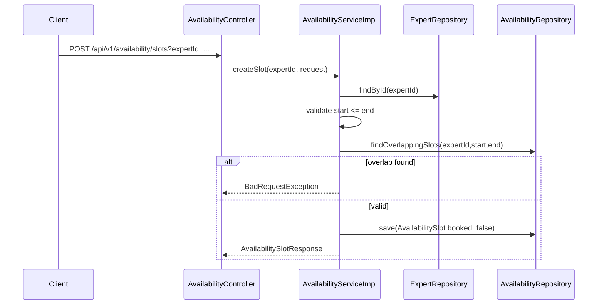

Important actual behavior: overlap detection only checks unbooked slots. A booked historical or future slot may not block an overlapping new availability slot.

### Booking APIs

`POST /api/v1/bookings`:

1. Controller resolves current user ID through `UserService.getUserByEmail`.
2. Service loads `User`.
3. Service loads `AvailabilitySlot`.
4. `validateBookingEligibility` reloads the slot and user, rejects if slot is booked or expert owns the slot.
5. Service checks `slot.getBooked()` again.
6. Creates `Booking` with `PENDING`, `paymentStatus=INITIATED`, and `amount=expert.hourlyRate`.
7. Saves booking.

Actual consistency caveat: booking creation does not set `AvailabilitySlot.booked=true`. The slot is only marked booked on `confirmBooking`, after payment success.

`PUT /api/v1/bookings/confirm/{id}`:

- Requires `Booking.paymentStatus == SUCCESS`.
- Sets `bookingStatus=CONFIRMED`.
- Sets linked slot `booked=true`.

`PUT /api/v1/bookings/cancel/{id}`:

- Rejects `COMPLETED` and `CANCELLED`.
- Sets `bookingStatus=CANCELLED`.
- Sets linked slot `booked=false`.

### Payment APIs

`POST /api/v1/payments/initiate`:

- Loads booking.
- Creates `Payment` with amount copied from booking, `INITIATED`, `INR`, and `RAZORPAY`.
- Does not create a Razorpay order through SDK.
- Does not set `transactionId`.

`POST /api/v1/payments/verify`:

- Looks up payment by `razorpayPaymentId` via `PaymentRepository.findByTransactionId`.
- Verifies HMAC SHA-256 signature over `orderId|paymentId`.
- Sets `Payment.paymentStatus=SUCCESS`, `paidAt=now`.
- Sets `Booking.paymentStatus=SUCCESS`.

Actual bug: because `initiatePayment` does not set `transactionId`, `verifyPayment` cannot find the payment by Razorpay payment ID unless another process has already populated `transactionId`.

`POST /api/v1/payments/webhook` expects a JSON map containing `payment_id`, `order_id`, and `signature`, then delegates to `verifyPayment`.

### Review APIs

`POST /api/v1/reviews`:

- Controller resolves current user ID.
- Service loads reviewer and booking.
- Validates booking belongs to user, booking status is `COMPLETED`, and no review exists.
- Saves one `Review` per booking.
- Recalculates expert average rating from all expert reviews.

Actual workflow gap: no implemented API transitions `Booking` to `COMPLETED`, so the review happy path requires out-of-band data mutation or future code.

### Session APIs

`POST /api/v1/sessions` creates one session per booking with `SCHEDULED`.

`PUT /api/v1/sessions/{id}/start` allows only `SCHEDULED -> ONGOING`.

`PUT /api/v1/sessions/{id}/end` allows only `ONGOING -> COMPLETED`.

`PUT /api/v1/sessions/{id}/meeting-link` sets any non-blank meeting link.

`PUT /api/v1/sessions/{id}/recording-url` allows recording URL only when session is `COMPLETED`.

There is no external video provider integration.

## 5. Database and Entity Analysis

### ER Diagram

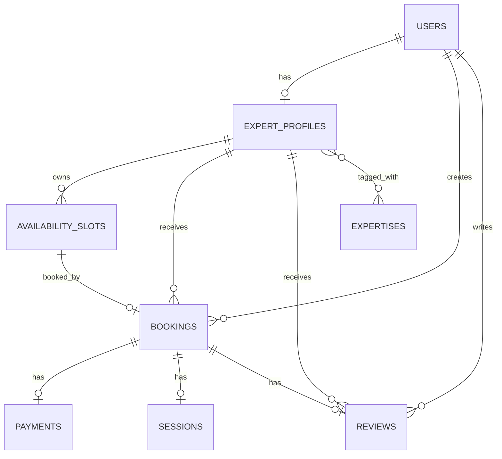

### Tables and Relationships

| Entity | Table | Primary relationships |
|---|---|---|
| `User` | `users` | One-to-one expert profile, one-to-many bookings, one-to-many reviews. |
| `ExpertProfile` | `expert_profiles` | One-to-one user, many-to-many expertise, one-to-many slots/bookings/reviews. |
| `Expertise` | `expertises` | Many-to-many expert profiles through `expert_expertise`. |
| `AvailabilitySlot` | `availability_slots` | Many-to-one expert profile, one-to-one booking. |
| `Booking` | `bookings` | Many-to-one user and expert profile, one-to-one slot/payment/session/review. |
| `Payment` | `payments` | One-to-one booking. |
| `Review` | `reviews` | One-to-one booking, many-to-one reviewer and expert profile. |
| `Session` | `sessions` | One-to-one booking. |

### Constraints and Indexes

Implemented JPA constraints:

- UUID primary keys for all entities.
- Unique `users.email`.
- Unique `expert_profiles.user_id`.
- Unique `bookings.availability_slot_id`.
- Unique `payments.booking_id`.
- Unique `reviews.booking_id`.
- Unique `sessions.booking_id`.
- Unique `expertises(name, category)`.
- Numeric constraints on rating and positive monetary fields via validation annotations.

Implemented indexes:

- `users`: email, status
- `expert_profiles`: user, verification status, average rating
- `expertises`: category
- `availability_slots`: expert, start time, booked
- `bookings`: user, expert, booking status
- `payments`: booking, payment status
- `reviews`: booking, expert, reviewer
- `sessions`: booking, session status

### Migrations and DDL

Flyway is enabled in `application.yml`, but no migration files are present under `src/main/resources/db/migration`. JPA is configured with `ddl-auto: validate` for runtime PostgreSQL. Therefore, production startup expects an existing schema that matches entities. Without migrations, a fresh PostgreSQL database will fail validation.

### Auditing

There is no Spring Data auditing configuration. Timestamps are entity-local:

- `@CreationTimestamp`: users, expert profiles, availability slots, bookings, reviews.
- `@UpdateTimestamp`: users, expert profiles.
- `Payment.createdAt` is marked `insertable=false, updatable=false`, implying database-side default is expected, but no migration/default is provided.

### Aggregate Boundaries

The code does not explicitly implement DDD aggregates, but the operational aggregates are:

- User aggregate: `User` plus optional `ExpertProfile`.
- Expert aggregate: `ExpertProfile`, expertise tags, availability slots.
- Booking aggregate: `Booking`, `AvailabilitySlot`, `Payment`, `Session`, `Review`.

The strongest consistency boundary is currently the service method transaction, not aggregate-specific repositories.

## 6. State Machine Analysis

### User Status

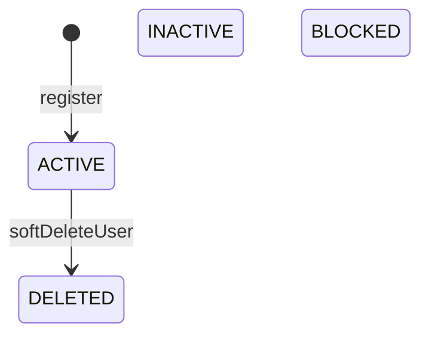

Implemented transitions: only registration to `ACTIVE` and soft delete to `DELETED`.

Enums exist for `INACTIVE` and `BLOCKED`, but no service transition uses them.

### Expert Verification

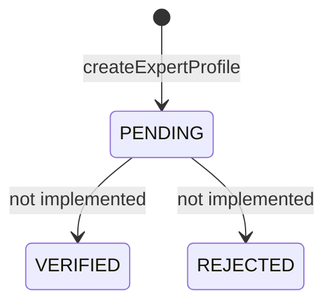

Search and top-rated APIs only return `VERIFIED` experts. There is no admin verification endpoint.

### Booking Status

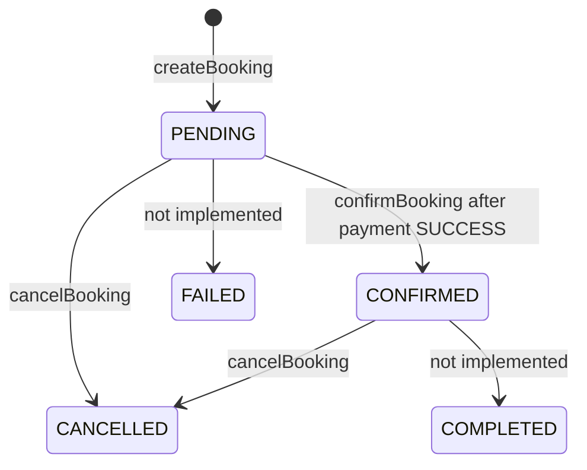

Invalid transitions enforced:

- Cannot cancel `COMPLETED`.
- Cannot cancel already `CANCELLED`.
- Cannot confirm unless payment status is `SUCCESS`.

### Payment Status

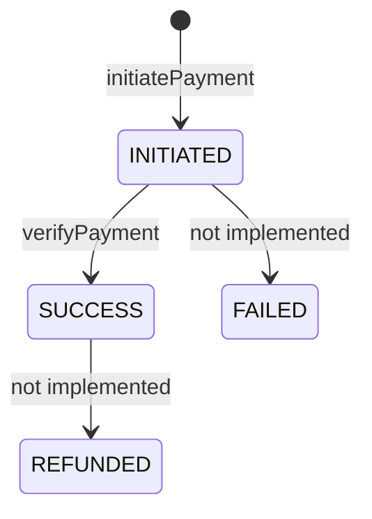

No retry, refund, failed-payment handling, or idempotency key exists.

### Session Status

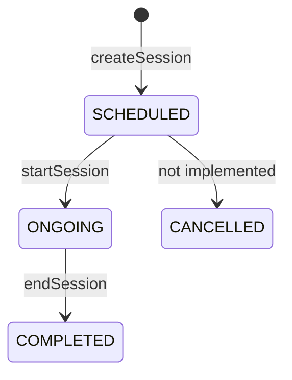

Invalid transitions enforced:

- Start requires `SCHEDULED`.
- End requires `ONGOING`.
- Recording URL requires `COMPLETED`.

## 7. Security Architecture

### Spring Security Configuration

Implemented in `SecurityConfig`:

- CSRF disabled.
- Stateless session management.
- Method security enabled through `@EnableMethodSecurity`.
- Custom `JwtAuthenticationFilter` inserted before `UsernamePasswordAuthenticationFilter`.
- BCrypt password encoder bean.
- `AuthenticationManager` bean from `AuthenticationConfiguration`.

URL rules:

| Matcher | Access |
|---|---|
| `/api/v1/auth/**` | Public |
| `/actuator/**` | Public |
| `/swagger-ui/**`, `/swagger-ui.html`, `/v3/api-docs/**` | Public |
| GET `/api/v1/experts/search` | Public |
| GET `/api/v1/experts/top-rated` | Public |
| GET `/api/v1/experts/{id}` | Public |
| GET `/api/v1/experts/availability/{expertId}` | Public |
| GET `/api/v1/reviews/expert/{expertId}` | Public |
| `/api/v1/bookings/**` | `ROLE_USER` or `ROLE_EXPERT` |
| `/api/v1/admin/**` | `ROLE_ADMIN` |
| everything else | Authenticated |

### Authentication Flow

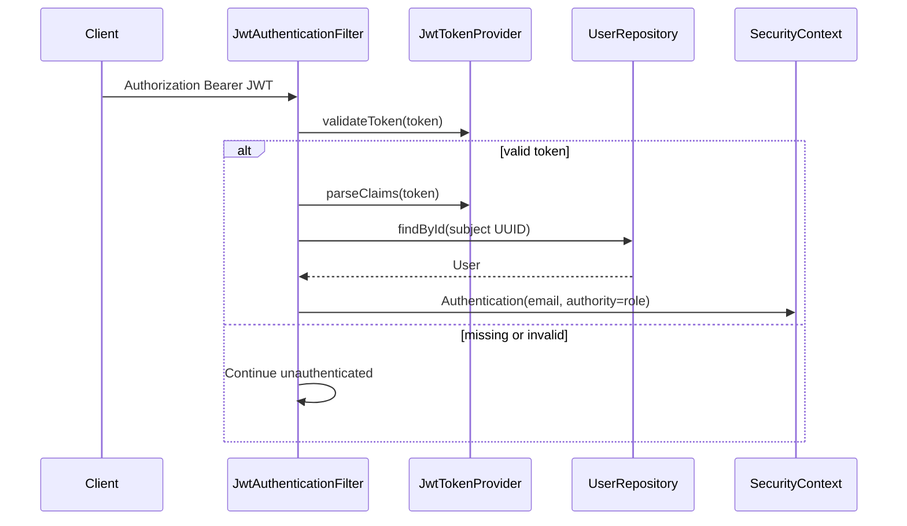

### Token Lifecycle

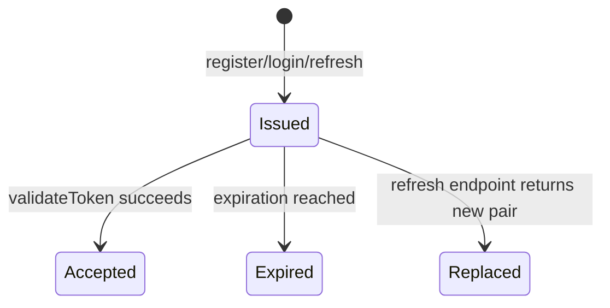

Access token lifetime: 1 day in service code (`60 * 24` minutes).

Refresh token lifetime: 30 days in service code (`60L * 24 * 30` minutes).

Configuration properties `jwt.expiration` and `jwt.refresh-expiration` exist but are not used by `AuthServiceImpl`.

### User Context Propagation

The filter sets principal to the user email, not the user UUID. Controllers that need user ID call `SecurityUtil.getCurrentUserEmail()` and then `UserService.getUserByEmail`. `SecurityUtil.getCurrentUserId()` attempts to parse the principal as UUID and therefore does not work with the current filter behavior.

### Security Gaps

- No object ownership checks on many endpoints: fetching any user by ID, updating any expert profile by expert ID, managing availability for any expert ID, confirming/canceling any booking by ID.
- No method-level `@PreAuthorize` annotations despite `@EnableMethodSecurity`.
- Refresh tokens are stateless and cannot be revoked.
- Logout endpoint is absent.
- Payment webhook is authenticated by normal application security unless publicly configured elsewhere, which may not match gateway behavior.
- JWT secret is stored in YAML placeholder rather than environment-backed secret management.

## 8. Design Pattern Analysis

| Pattern | Actual implementation | Benefit | Tradeoff |
|---|---|---|---|
| Layered architecture | Controllers, services, repositories, entities | Easy to navigate, conventional Spring model | Domain logic coupled to services and JPA entities |
| Repository | Spring Data `JpaRepository` interfaces | Reduces persistence boilerplate | Query behavior hidden in method names/JPQL |
| DTO | `common.dto` and `auth.dto` | Prevents direct entity exposure | Manual mapping duplicated inside services |
| Builder | Lombok `@Builder` on entities/DTOs | Concise object construction | Builder defaults ignored without `@Builder.Default`, compiler warns |
| Template/declarative transaction | `@Transactional` at service classes/methods | Consistent unit-of-work handling | Internal method calls share same transaction, read-only intent not always effective when called internally |
| Filter chain | `OncePerRequestFilter` for JWT | Central authentication handling | Invalid tokens silently continue unauthenticated |
| Exception mapper | `@RestControllerAdvice` | Uniform API error shape | Generic handler hides internal cause from clients |

Not implemented:

- Factory, Strategy, Adapter, Observer, CQRS, event sourcing, specifications, or domain events.

## 9. Transaction and Consistency Analysis

### Transaction Boundaries

| Service | Boundary |
|---|---|
| `AuthServiceImpl.register` | Jakarta `@Transactional` method only. |
| `UserServiceImpl` | Class-level transaction, read-only on reads. |
| `ExpertServiceImpl` | Class-level transaction, read-only on reads. |
| `AvailabilityServiceImpl` | Class-level transaction, read-only on reads. |
| `BookingServiceImpl` | Class-level transaction, read-only on reads. |
| `PaymentServiceImpl` | Class-level transaction, read-only on payment lookup. |
| `ReviewServiceImpl` | Class-level transaction, read-only on reads/eligibility. |
| `SessionServiceImpl` | Class-level transaction. |

### Critical Consistency Flows

Booking confirmation transaction:

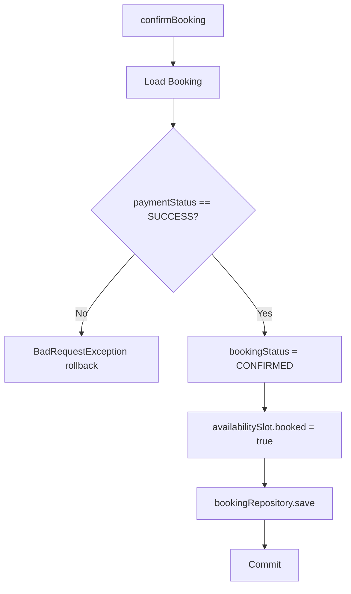

Payment verification transaction:

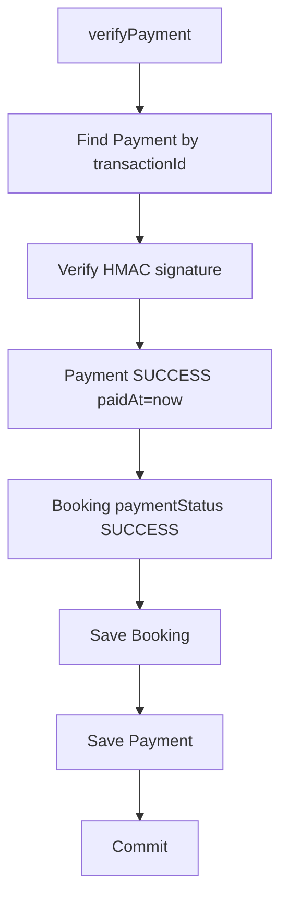

Review creation transaction:

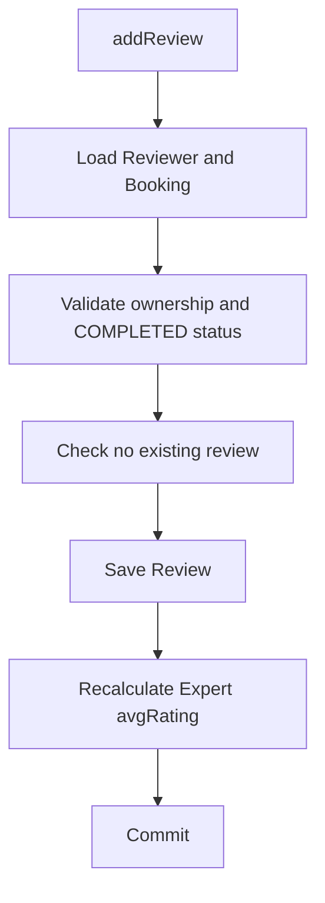

### Consistency Risks

- Booking creation does not reserve or lock the slot, so concurrent users could create multiple pending bookings for the same slot until database uniqueness on `availability_slot_id` rejects one transaction.
- `existsByAvailabilitySlotIdAndBookingStatusNot` exists but is unused.
- Payment initiation can create duplicate payment attempts for the same booking, but the `payments.booking_id` unique constraint may reject duplicates at flush/commit.
- Payment verification lookup by transaction ID conflicts with initiation not setting transaction ID.
- No optimistic or pessimistic locking is implemented.
- No idempotency key is implemented for booking/payment APIs.

## 10. Async and Event-Driven Architecture

No async/event-driven architecture is implemented.

Search results for the codebase show no:

- `@Async`
- `@Scheduled`
- Spring application events
- Kafka
- RabbitMQ
- Redis pub/sub
- Message listeners
- Dead-letter queues
- Retry templates

All workflows are synchronous HTTP request/response flows.

## 11. API Documentation Analysis

### API Catalog

| Method | Endpoint | Auth | Controller | Service |
|---|---|---|---|---|
| POST | `/api/v1/auth/register` | Public | `AuthController` | `AuthService.register` |
| POST | `/api/v1/auth/login` | Public | `AuthController` | `AuthService.login` |
| POST | `/api/v1/auth/refresh?token=` | Public | `AuthController` | `AuthService.refresh` |
| GET | `/api/v1/users/me` | Authenticated | `UserController` | `UserService.getUserByEmail` |
| PUT | `/api/v1/users/me` | Authenticated | `UserController` | `UserService.updateUserProfile` |
| DELETE | `/api/v1/users/me` | Authenticated | `UserController` | `UserService.softDeleteUser` |
| GET | `/api/v1/users/{id}` | Authenticated | `UserController` | `UserService.getUserById` |
| POST | `/api/v1/experts/profile` | Authenticated | `ExpertController` | `ExpertService.createExpertProfile` |
| PUT | `/api/v1/experts/profile/{expertId}` | Authenticated | `ExpertController` | `ExpertService.updateExpertProfile` |
| GET | `/api/v1/experts/{id}` | Public | `ExpertController` | `ExpertService.getExpertProfile` |
| GET | `/api/v1/experts/search?query=` | Public | `ExpertController` | `ExpertService.searchExpertsByQuery` |
| GET | `/api/v1/experts/top-rated` | Public | `ExpertController` | `ExpertService.getTopRatedExperts` |
| GET | `/api/v1/experts/availability/{expertId}` | Public | `ExpertController` | `AvailabilityService.getAvailableSlots` |
| POST | `/api/v1/experts/{expertId}/expertise` | Authenticated | `ExpertController` | `ExpertService.addExpertise` |
| POST | `/api/v1/availability/slots?expertId=` | Authenticated | `AvailabilityController` | `AvailabilityService.createSlot` |
| PUT | `/api/v1/availability/slots/{id}` | Authenticated | `AvailabilityController` | `AvailabilityService.updateSlot` |
| DELETE | `/api/v1/availability/slots/{id}` | Authenticated | `AvailabilityController` | `AvailabilityService.deleteSlot` |
| GET | `/api/v1/availability/expert/{expertId}` | Authenticated | `AvailabilityController` | `AvailabilityService.getAvailableSlots` |
| POST | `/api/v1/bookings` | USER/EXPERT | `BookingController` | `BookingService.createBooking` |
| GET | `/api/v1/bookings/{id}` | USER/EXPERT | `BookingController` | `BookingService.getBooking` |
| GET | `/api/v1/bookings/my-bookings` | USER/EXPERT | `BookingController` | `BookingService.getMyBookings` |
| PUT | `/api/v1/bookings/cancel/{id}` | USER/EXPERT | `BookingController` | `BookingService.cancelBooking` |
| PUT | `/api/v1/bookings/confirm/{id}` | USER/EXPERT | `BookingController` | `BookingService.confirmBooking` |
| POST | `/api/v1/payments/initiate` | Authenticated | `PaymentController` | `PaymentService.initiatePayment` |
| POST | `/api/v1/payments/verify` | Authenticated | `PaymentController` | `PaymentService.verifyPayment` |
| POST | `/api/v1/payments/webhook` | Authenticated | `PaymentController` | `PaymentService.handlePaymentCallback` |
| GET | `/api/v1/payments/{bookingId}` | Authenticated | `PaymentController` | `PaymentService.getPaymentByBooking` |
| POST | `/api/v1/reviews` | Authenticated | `ReviewController` | `ReviewService.addReview` |
| GET | `/api/v1/reviews/expert/{expertId}` | Public | `ReviewController` | `ReviewService.getReviewsByExpert` |
| POST | `/api/v1/sessions` | Authenticated | `SessionController` | `SessionService.createSession` |
| PUT | `/api/v1/sessions/{id}/start` | Authenticated | `SessionController` | `SessionService.startSession` |
| PUT | `/api/v1/sessions/{id}/end` | Authenticated | `SessionController` | `SessionService.endSession` |
| PUT | `/api/v1/sessions/{id}/meeting-link` | Authenticated | `SessionController` | `SessionService.saveMeetingLink` |
| PUT | `/api/v1/sessions/{id}/recording-url` | Authenticated | `SessionController` | `SessionService.saveRecordingUrl` |

### Response Format

All controllers return:

```json
{
  "success": true,
  "message": "Operation message",
  "data": {},
  "timestamp": "server-local-date-time"
}
```

### Validation

Validation is DTO-based through `@Valid`:

- Registration: firstName, email, password, phone required.
- Login: email and password expected by DTO.
- Expert profile: headline, bio, experience years, hourly rate, expertise IDs.
- Booking: availability slot ID.
- Review: booking ID, rating 1 to 5, comment max length.
- Session/payment helper DTOs: non-null or non-blank fields.

## 12. Business Workflow Documentation

### User Registration

Happy path:

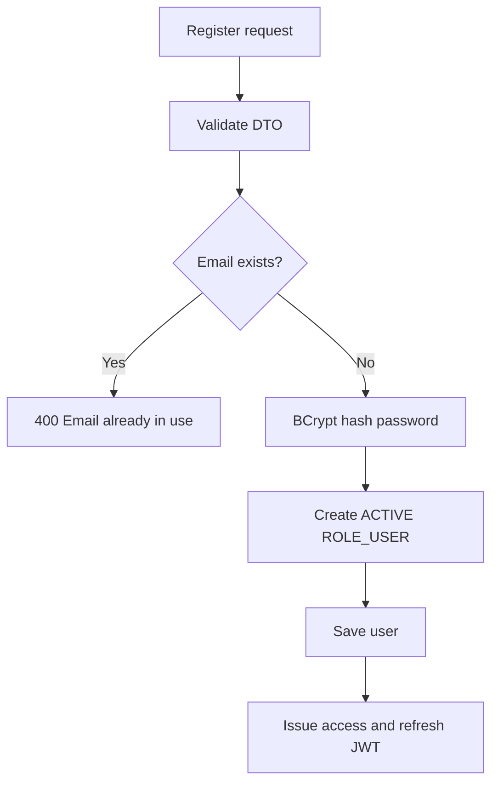

Failure paths:

- Duplicate email returns 400.
- Validation failure returns 400.
- Database failure returns 500 through generic handler.

### Login

Happy path:

- Authenticate with Spring Security `AuthenticationManager`.
- Load user through `CustomUserDetailsService`.
- Return JWT pair.

Failure path:

- Bad password triggers `BadCredentialsException`, mapped to 401.
- Inactive/deleted user is disabled by `CustomUserDetailsService`.

### Expert Onboarding

Happy path:

- Authenticated user submits profile.
- Profile saved as `PENDING`.
- Expertise IDs must already exist.

Failure path:

- Missing user or expertise returns 404.
- No implemented role check requiring `ROLE_EXPERT`.
- No implemented verification approval flow.

### Booking Lifecycle

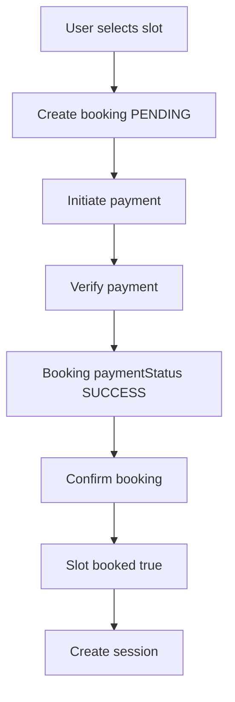

Compensation:

- `cancelBooking` marks booking cancelled and slot available.
- No refund flow is implemented.

### Payment Lifecycle

Happy path intended by code:

1. Initiate payment row.
2. Gateway returns order/payment/signature.
3. Verify signature.
4. Mark payment and booking payment status successful.

Current implementation gap:

- Payment row lookup expects `transactionId` to already equal Razorpay payment ID.

### Review Flow

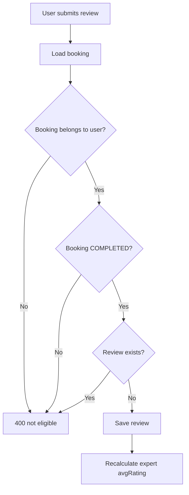

### Session Lifecycle

- Create session from booking.
- Start only from scheduled.
- End only from ongoing.
- Save recording only after completed.

## 13. Performance Analysis

Implemented performance features:

- Lazy loading on most relationships.
- Index annotations on commonly queried columns.
- Pagination on expert search and top-rated endpoints.
- Hibernate JDBC batch size configured.
- Server response compression enabled.

Potential bottlenecks:

- Manual DTO mapping touches lazy relations and can cause N+1 queries, especially expert responses mapping `expertises`.
- `ReviewService.updateExpertRating` loads all reviews for an expert to average in memory.
- Expert search uses `LOWER(...) LIKE '%query%'`, which is not efficient for large datasets.
- No cache is implemented for public expert search/profile endpoints.
- No locking on slots for concurrent booking attempts.
- Logging config enables DEBUG for Spring web/security and Hibernate SQL, expensive for production.

## 14. Infrastructure and DevOps Analysis

Implemented infrastructure artifacts:

- Gradle wrapper.
- Application YAML.
- Basic Spring Boot test.

Not implemented:

- Dockerfile.
- Docker Compose.
- Kubernetes manifests.
- CI/CD workflows. The only `.github` file found is `.github/agents/drockley.agent.md`, which is a placeholder custom-agent descriptor, not a build/deploy pipeline.
- Environment profiles.
- Secret manager integration.
- Migration scripts.

Deployment topology implied by code:

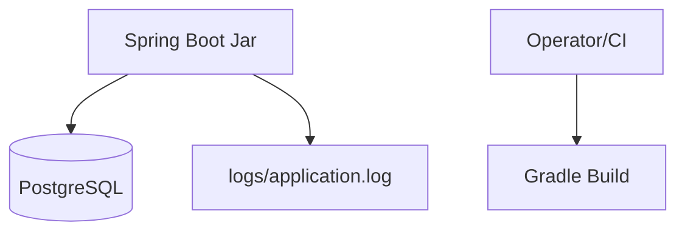

## 15. Configuration Analysis

`application.yml` defines:

- `spring.application.name=drockley`
- PostgreSQL datasource at `localhost:5432/education_platform`
- JPA `ddl-auto=validate`
- Hibernate PostgreSQL dialect, formatting, batching
- Flyway enabled but no migrations exist
- Jackson timezone UTC
- Multipart limits
- JWT secret and expiration values
- Razorpay key placeholders
- Springdoc paths
- Server port 8080
- Verbose logging
- Management health/info/metrics exposure

`application.properties` only sets `spring.application.name=drockley`, duplicating YAML.

Configuration mismatches:

- README mentions `security.jwt.secret`, while actual YAML uses `jwt.secret`.
- `ApplicationProperties` binds `security.jwt.secret`, but `JwtTokenProvider` reads `jwt.secret` with fallback to `security.jwt.secret`.
- `jwt.expiration` and `jwt.refresh-expiration` are not consumed by code.
- Razorpay property names in YAML are `razorpay.key-id` and `razorpay.key-secret`, while `PaymentServiceImpl` reads `razorpay.key.id` and `razorpay.key.secret`. Spring relaxed binding may not map these nested/dotted variants as intended; this should be tested.

## 16. Common Utilities and Frameworks

### `ApiResponse<T>`

Record carrying:

- `success`
- `message`
- `data`
- `timestamp`

Used by all controllers and exception handler.

### `GlobalExceptionHandler`

Maps known exceptions:

- `NotFoundException` to 404
- `BadRequestException` to 400
- `UnauthorizedException` to 401
- `ForbiddenException` to 403
- `DuplicateResourceException` to 409
- `BookingConflictException` to 409
- `BadCredentialsException` to 401
- Validation exceptions to 400
- Everything else to 500

### Utilities

- `DateTimeUtil`: local date-time formatting/parsing and basic comparisons. Not currently used in services/controllers.
- `PaginationUtil`: creates bounded `Pageable`. Not currently used because controllers rely on Spring `Pageable`.
- `SecurityUtil`: reads `SecurityContextHolder`. `getCurrentUserEmail` is used by controllers. `getCurrentUserId` is currently inconsistent with the JWT filter principal.

## 17. Code Flow Traceability

### Register

```text
AuthController.register
-> AuthServiceImpl.register
-> UserRepository.existsByEmail
-> PasswordEncoder.encode
-> UserRepository.save
-> JwtTokenProvider.generateToken
-> ApiResponse<AuthResponse>
```

### Login

```text
AuthController.login
-> AuthServiceImpl.login
-> AuthenticationManager.authenticate
-> CustomUserDetailsService.loadUserByUsername
-> UserRepository.findByEmail
-> JwtTokenProvider.generateToken
-> ApiResponse<AuthResponse>
```

### Create Expert Profile

```text
ExpertController.createProfile
-> SecurityUtil.getCurrentUserEmail
-> UserServiceImpl.getUserByEmail
-> ExpertServiceImpl.createExpertProfile
-> UserRepository.findById
-> ExpertiseRepository.findById for each expertise ID
-> ExpertRepository.save
-> manual mapExpertToResponse
```

### Create Availability Slot

```text
AvailabilityController.createSlot
-> AvailabilityServiceImpl.createSlot
-> ExpertRepository.findById
-> AvailabilityServiceImpl.validateSlotOverlap
-> AvailabilityRepository.findOverlappingSlots
-> AvailabilityRepository.save
-> manual mapSlotToResponse
```

### Create Booking

```text
BookingController.createBooking
-> SecurityUtil.getCurrentUserEmail
-> UserServiceImpl.getUserByEmail
-> BookingServiceImpl.createBooking
-> UserRepository.findById
-> AvailabilityRepository.findById
-> BookingServiceImpl.validateBookingEligibility
-> AvailabilityRepository.findById
-> UserRepository.findById
-> BookingRepository.save
-> manual mapBookingToResponse
```

### Verify Payment

```text
PaymentController.verifyPayment
-> PaymentServiceImpl.verifyPayment
-> PaymentRepository.findByTransactionId
-> PaymentServiceImpl.verifyRazorpaySignature
-> PaymentServiceImpl.generateSignature
-> BookingRepository.save
-> PaymentRepository.save
-> manual mapPaymentToResponse
```

### Add Review

```text
ReviewController.addReview
-> SecurityUtil.getCurrentUserEmail
-> UserServiceImpl.getUserByEmail
-> ReviewServiceImpl.addReview
-> UserRepository.findById
-> BookingRepository.findById
-> ReviewServiceImpl.validateReviewEligibility
-> ReviewRepository.existsByBookingId
-> ReviewRepository.save
-> ReviewServiceImpl.updateExpertRating
-> ExpertRepository.save
```

## 18. Technical Debt and Refactoring Recommendations

High priority:

- Add object-level authorization checks for users, bookings, expert profiles, slots, payments, sessions, and reviews.
- Fix payment verification model: store gateway order ID and payment ID separately, make verification find payment by order ID or internal payment ID.
- Add slot reservation semantics at booking creation or add database/application locking to prevent concurrent slot conflicts.
- Add Flyway migrations matching entities because runtime uses `ddl-auto=validate`.
- Align service implementation physical paths with declared `service.impl` package.
- Fix `SecurityUtil.getCurrentUserId` or set JWT authentication principal to user UUID plus email details.
- Consume configured JWT expiration values instead of hardcoding durations.
- Add endpoint to transition booking to `COMPLETED`, or review flow remains unreachable through public APIs.
- Add expert verification/admin workflow or public search will return no newly created experts.

Medium priority:

- Replace manual mapping with dedicated mapper classes or MapStruct.
- Add integration tests for auth, booking, payment, and review flows.
- Add `@Builder.Default` to entity fields with default initializers or avoid entity builders.
- Reduce production logging levels.
- Add optimistic locking to booking/slot/payment entities.
- Add idempotency for booking and payment endpoints.
- Add DB-level defaults for `Payment.createdAt` or use `@CreationTimestamp`.

Low priority:

- Remove unused utilities or wire them into controllers/services.
- Split common DTO package by domain as the API grows.
- Add OpenAPI metadata customization.

## 19. Architectural Decision Analysis

The codebase reflects an MVP modular-monolith decision:

- One deployable unit.
- Shared database.
- Synchronous request/response business workflows.
- Domain modules separated mostly by class naming and package groups, not by independent bounded contexts.

Tradeoffs chosen:

- Faster feature development over distributed scalability.
- Spring Data repositories over hand-written persistence adapters.
- Stateless JWT over server-side sessions.
- Manual mapping over mapper framework complexity.
- Database consistency through local transactions, not events.

The blueprint mentions future scalability and integrations, but the actual implementation remains intentionally simple. That is appropriate for an early backend, provided the documented gaps are addressed before production use.

## 20. Onboarding Documentation

### How to Run

Prerequisites:

- JDK compatible with Gradle Java toolchain 25.
- PostgreSQL running on `localhost:5432`.
- Database named `education_platform`.
- Schema already created to match entities, because Flyway migrations are absent and JPA validates only.

Commands:

```powershell
.\gradlew.bat build
.\gradlew.bat bootRun
```

If existing `build` output is locked on Windows, use:

```powershell
.\gradlew.bat --% -Dorg.gradle.project.buildDir=build-local test
```

### Entry Points

- Application main: `DrockleyApplication`
- Public auth API: `AuthController`
- Security setup: `SecurityConfig`
- JWT filter: `JwtAuthenticationFilter`
- Business services: `*ServiceImpl`
- Persistence: `*Repository`

### Debugging Approach

1. Start with the controller endpoint from the API catalog.
2. Follow the service interface and implementation.
3. Check transaction annotation on the service class/method.
4. Inspect repository query methods or JPQL.
5. Inspect entity relationships and lazy loads.
6. For auth issues, inspect JWT claims and `SecurityContextHolder`.
7. For unexpected HTTP status codes, inspect `GlobalExceptionHandler`.

### Common Troubleshooting

| Symptom | Likely cause |
|---|---|
| App fails on startup with schema errors | PostgreSQL schema missing; Flyway migrations absent; JPA is validate-only. |
| Authenticated endpoint returns 403 | JWT role claim does not match `ROLE_USER`, `ROLE_EXPERT`, or `ROLE_ADMIN`. |
| Current user ID is null | `SecurityUtil.getCurrentUserId` expects UUID principal, but filter stores email principal. |
| Expert search returns empty | Only `VERIFIED` profiles are searchable; new profiles are `PENDING`. |
| Review cannot be created | Booking must be `COMPLETED`, but no API currently completes booking. |
| Payment verify cannot find payment | Payment initiation does not set `transactionId`; verification searches by transaction ID. |
| Fresh DB does not initialize | Flyway is enabled, but migrations are missing. |

### Safe Extension Guidelines

- Add migrations before changing entities.
- Put new business rules in services, not controllers.
- Add ownership checks near service entry points.
- Keep response DTOs separate from entities.
- Add integration tests for any state transition.
- Prefer explicit state transition methods over direct enum mutation.
- Treat payment and booking flows as consistency-critical.
